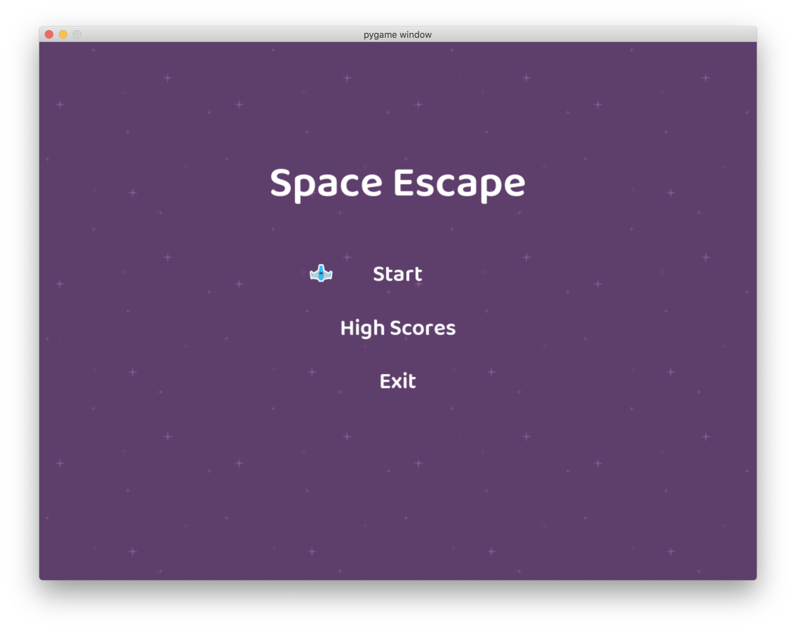
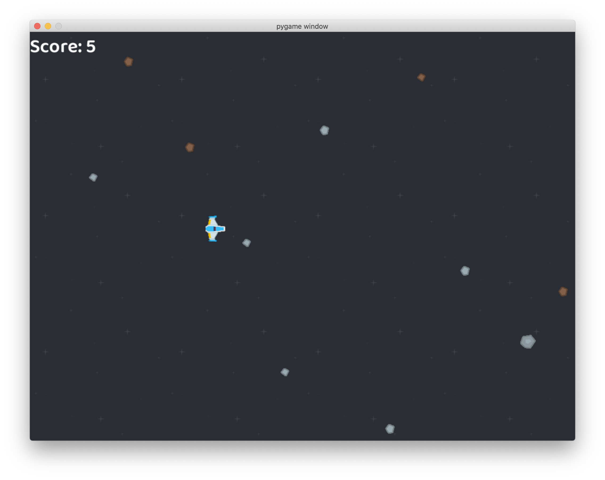

# Espace Escape

Space Escape is a 2D endless scroll game in which a spaceship will travel across an asteroid field. The player has the mission of control the space ship and avoid any danger that can impact the craft.

## Features

1. The spaceship has an inertia associated, so be careful when you want to perform a direction change.
1. The field will be denser and more challenging as further you go.
1. In the end, maybe you can find other life forms.

## Installation

Space Escape uses Python an easy to learn, powerful programming language. If you don't already have it, you can download it from [python.org](python.org). Python 3.7 or greater is required. For Windows users, please refer to [Python for Windows](https://docs.python.org/3/using/windows.html)

The best way to install Space Escape is with the [pip](https://pip.pypa.io/en/stable/) tool (which is what python uses to install packages). Note, this comes with python in recent versions. We use the --user flag to tell it to install into the home directory, rather than globally.

``` bash
python3 -m pip install -U space-escape-raksoiv --user
```


## Play the Game

To start the game write in whatever terminal o command line:

```bash
space-escape
```

## Screenshots





## Starting Idea

This game starts from a tutorial of pygame https://realpython.com/pygame-a-primer/. In this tutorial, the student is encouraged to program a game about an airplane that needs to avoid rockets incoming. The first result of the game was precisely a spaceship that avoids asteroids, the change in the sprites of the game was due to a subscription to download the art pack.
So I take the sprites and arts from: https://opengameart.org/content/space-shooter-redux.

## A playable game

After the first success of a piece of code than can represent a game, the idea of doing this game playable was increasing in time. So I take the journey, from one script to a total game, starting from the menu of the game and give a player a score for his efforts to go across the field.

With the adition of the hoghscore menú and sfx sounds, the game has finally arrive to a playable state. Now the game save you score and give you sound feedback of your input. The objective is complete.

## And beyond

After achieving the playable state, I start thinking about how to add enjoyment to the game, most of the 2D games out there have some kind of shooting experience. But this game has no guns and the addition of that kind of feature can affect the core of the game, in which case it is easier to start from scratch with a different game.
So I start looking at the game, what is the core mechanic and what is the objective. Finally, I realize that the project and the game are connected, they are both, journeys. A travel throw the space in the look for discovery. So, with this in mind, I start to add some features to reflect this. In the next weeks, the efforts will be focused on giving the player the experience of a journey.

## Backlog

The next steps in the development process are:

1. Credits
2. Screen pan with ship movement
3. Ship rotate with player input
4. Stages and stops
5. Background paralax
6. Background sparkles
7. Background planets
8. UFO

Any feedback or idea is well received in the [issues](https://github.com/Raksoiv/space-escape/issues) section.

Happy Flying!
